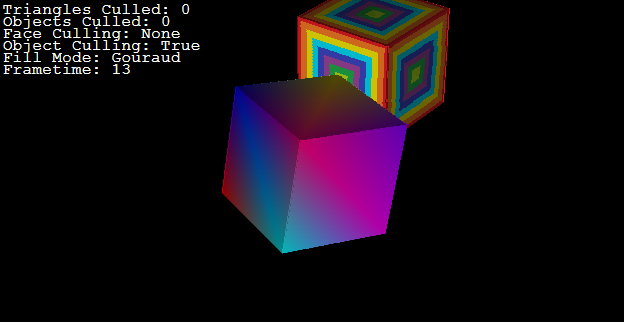
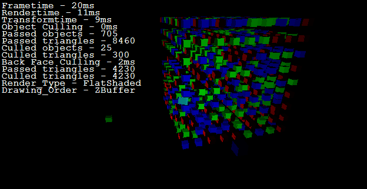

# simple-graphics-engine
A simple 3D Graphics Engine developed in Visual Basic .NET in 2013 as part of the Extended Project Qualification (EPQ). Includes basic physics support.

# Functionality
## Rendering
* Wireframe rendering
* Solid-fill
* Smooth-shading
* Texture-mapping

## Other features
* Object and triangle culling
* Back face culling
* Directional colour light support

# Screenshots
 | 
-------------------------------------------------------------|-----------------------------------------------------------------------
 | 

# Further Work
* Use object orientation to transform the scene into an object hierarchy, rather than list of objects to render.
* Replace slow memory bitmap drawing functions with [BitBlt](https://docs.microsoft.com/en-us/windows/win32/api/wingdi/nf-wingdi-bitblt).
* Use a preexisting, binary or json based file format to store models, objects
* Preprocess objects for smooth shading; for applicable models, calculate and store vertex normals.
* Implement clipping

# Additional Documentation
